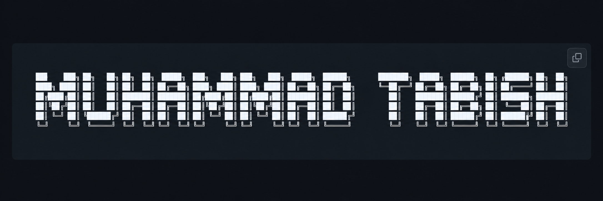

<div align="center">



<br/><br/>


<br/><br/>

<a href="https://github.com/tabishmishere">

</a>
<a href="https://linkedin.com/in/muhammadtabish1">

</a>
<a href="mailto:tabishm484@gmail.com">

</a>

</div>

<br/>

```yaml
name     : Muhammad Tabish
handle   : tabishmishere
location : Lahore, Pakistan

role     : Software Engineer
focus    : Full-Stack Development
stack    : MERN · Next.js
learning : NestJS · DevOps
status   : Open to opportunities & collaborations
```

---

### `> about.me`

I'm a **Software Engineer** focused on building practical and scalable web applications.

I work across the full stack, with a strong interest in **backend development, API design, databases, and production-ready applications**.

Currently, I'm going deeper into **NestJS and DevOps** while building real-world projects.

> `Consistency beats intensity — improving every single day.`

---

### `> tech.stack`

#### Languages

<p>


</p>

#### Frontend

<p>


</p>

#### Backend

<p>


</p>

#### Databases

<p>


</p>

#### DevOps & Tools

<p>


</p>

---

### `> engineering.focus`

```text
┌──────────────────────────────────────────────────────┐
│                                                      │
│  Frontend       → React · Next.js · Tailwind         │
│  Backend        → Node.js · Express · NestJS         │
│  Databases      → MongoDB · PostgreSQL · Redis       │
│  Architecture   → REST APIs · Auth · RBAC            │
│  DevOps         → Docker · CI/CD · AWS               │
│                                                      │
└──────────────────────────────────────────────────────┘
```

---

### `> featured.projects`

| Project                                                                              | Description                                                                 | Stack                          |
| ------------------------------------------------------------------------------------ | --------------------------------------------------------------------------- | ------------------------------ |
| [**Job Portal App**](https://github.com/tabishmishere/Job-Portal-App)                | Full-stack platform for browsing jobs, applying, and managing applications. | `MERN`                         |
| [**Hackathon Nest API**](https://github.com/tabishmishere/hackathon-nest-api)        | NestJS backend with authentication, RBAC, and scalable API architecture.    | `NestJS` `TypeScript` `Prisma` |
| [**AI Interview Prep App**](https://github.com/tabishmishere/AI-Interview-Prep-App)  | AI-powered platform for interview preparation and answer generation.        | `MERN` `AI`                    |
| [**DOM Practice Projects**](https://github.com/tabishmishere/DOM-Practice-Projects-) | JavaScript DOM exercises and small web projects.                            | `HTML` `CSS` `JavaScript`      |

---

### `> currently.working_on`

```javascript
const currentFocus = {
    building: "Full-Stack & Backend Projects",
    learning: "NestJS · DevOps",
    improving: "Architecture · Database Design · Production Engineering"
};
```

---

### `> github.stats`

<div align="center">


<br/><br/>


<br/><br/>


</div>

---

### `> activity.graph`

<div align="center">


</div>

---

### `> let's.connect`

<div align="center">

<a href="https://github.com/tabishmishere">

</a>

<a href="https://linkedin.com/in/muhammadtabish1">

</a>

<a href="https://tabishm-portfolio.vercel.app/">

</a>

<a href="mailto:tabishm484@gmail.com">

</a>

<br/><br/>


<br/><br/>

```text
// turning ideas into real-world products.
```

</div>
